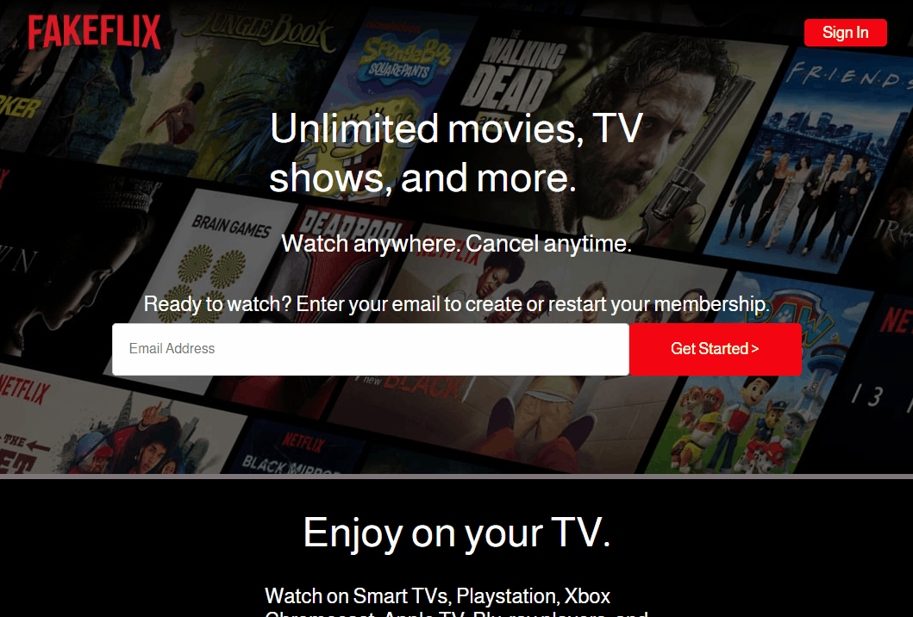
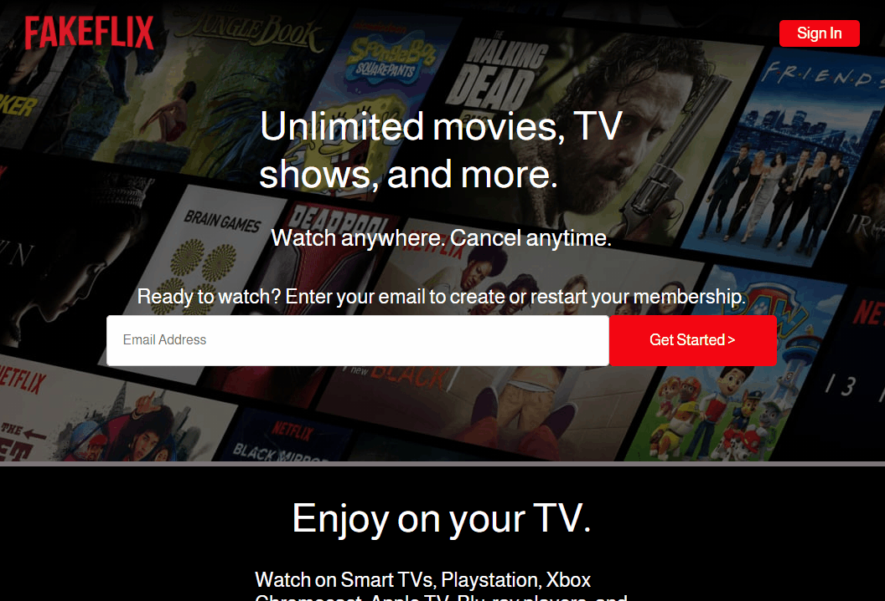
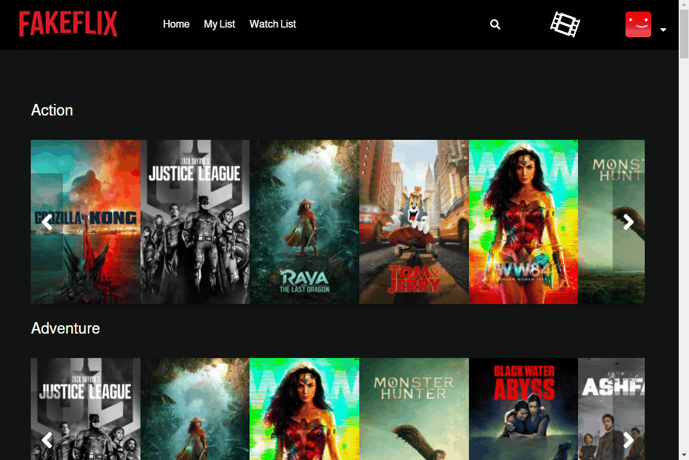
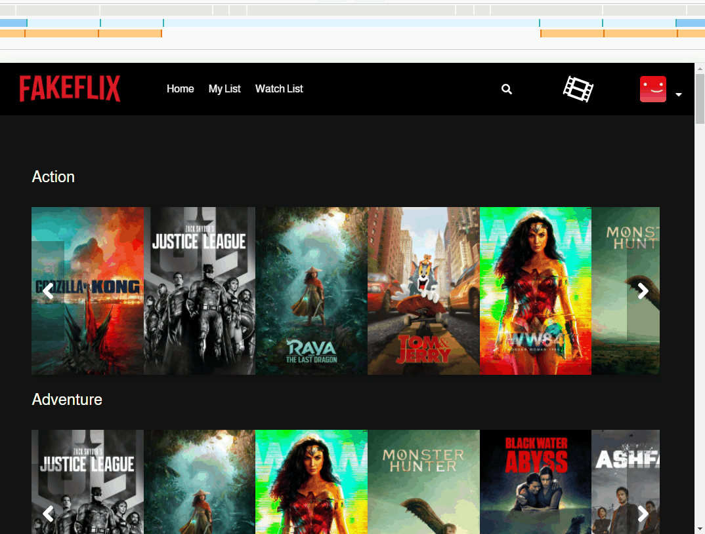
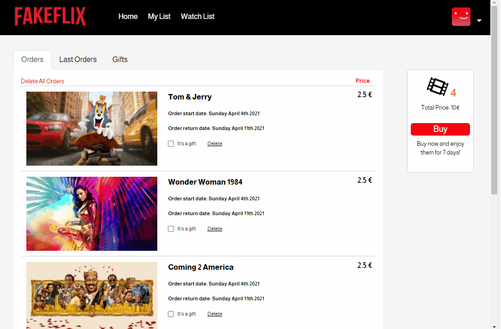
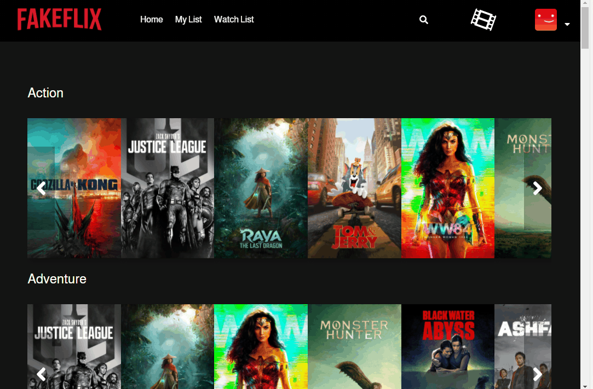
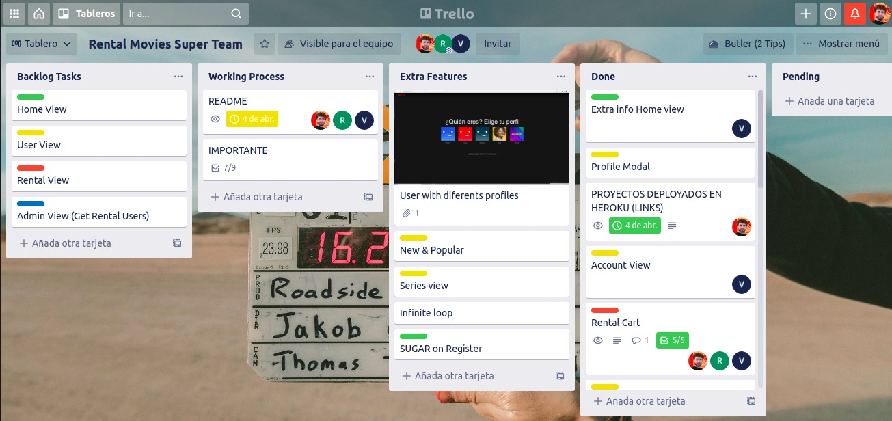

<!-- PROJECT LOGO -->
<br />
<p align="center">
  <a href="https://github.com/othneildrew/Best-README-Template">
    
  </a>

  <h3 align="center">Best Clone NETFLIX</h3>

  <p align="center">
    An awesome clone of Netflix!
    <br />
    <br />
    <a href="https://fakeflixmock.herokuapp.com/">View Demo</a>
  </p>
</p>


<!-- TABLE OF CONTENTS -->
<details open="open">
  <summary>Table of Contents</summary>
  <ol>
    <li>
      <a href="#installation">Installation</a>
    </li>
    <li>
      <a href="#about-the-project">About The Project</a>
    </li>
    <li>
      <a href="#app-overview">Overview</a>
    </li>
    <li><a href="#languages-and-tools">Languages and Tools</a></li>
    <li><a href="#license">License</a></li>
    <li><a href="#contact">Contact</a></li>
  </ol>
</details>

## Installation

Install the dependencies and devDependencies.

```sh
npm i
```
In the project directory, you can run:

```sh
npm start
```
And if you wish, you can run the scss

```sh
npm run scss
```


<!-- ABOUT THE PROJECT -->
## About The Project


Fakeflix is a Netflix Mock full-stack MERN web application that allows users to watch trailers from TMDb's. The back end of the application was built with Node.js, Mongoose and MongoDB database. All data fetching was done using Express and Axios for declaring JSON structures. The front end was created with React.js and JavaScript and utilizes the Redux architectural framework for an optimal single-page user-experience.

#### Authentication page
Back-end and front-end user authentication was built from scratch by encrypting user password and creating a unique session token for each user on sign up or login. This allows for secure access to one's account on the single-page application which then renders distinct content based on the current user.

#### Duration of the project

The project was done in 12 days, starting the 23rd of March 2021 and finishing the 4th of April 2021. Even though we would have loved to work longer in the project in order to add extra features.

#### Future Features:
- New & Popular movies section
- Series section
- Infinite loop for the carousels
- Extra steps on register 
- Add a real functionallity to the "like" button within the modal.
- Add the possibility to give away a movie to another user (Gifts)

[![Product Name Screen Shot][product-screenshot]](https://fakeflixmock.herokuapp.com/)


<!-- USAGE -->
## APP OVERVIEW

#### Registration & Login


<br>
<br>



<br>
<br>


<br>
<br>


<br>
<br>



<br>
<br>

#### User & Rental view


<br>
<br>



<br>
<br>


<br>
<br>


<br>
<br>


<br>
<br>



<br>
<br>


#### Profile & Watchlist view



<br>
<br>


<br>
<br>


<br>
<br>


---


<!-- BUGS -->
#### BUGS

- The add list button should remain in blue once you come back to the modal but it does not do it if the add cart is clicked.


<!-- ACKNOWLEDGEMENTS -->
## Languages and Tools:
<p align="left"> <a href="https://www.gnu.org/software/bash/" target="_blank">  </a> <a href="https://getbootstrap.com" target="_blank">  </a> <a href="https://www.w3schools.com/css/" target="_blank">  </a> <a href="https://www.docker.com/" target="_blank">  </a> <a href="https://expressjs.com" target="_blank">  </a> <a href="https://git-scm.com/" target="_blank">  </a> <a href="https://www.w3.org/html/" target="_blank">  </a> <a href="https://developer.mozilla.org/en-US/docs/Web/JavaScript" target="_blank">  </a>   </a> <a href="https://www.mongodb.com/" target="_blank">  </a> </a> <a href="https://nodejs.org" target="_blank">  </a>  <a href="https://postman.com" target="_blank">  </a> <a href="https://reactjs.org/" target="_blank">  </a>   </a>  </a>  </a>  </a> </a></p>

##### Our Trello




<!-- LICENSE -->
## License

Distributed under the MIT License. See `LICENSE` for more information.


<!-- CONTACT -->
## Contact

Diego García - [@diegogb-08](https://github.com/diegogb-08)
Robert de la Fuente - [@Roo-Git](https://github.com/Roo-Git)
Víctor Sanchis - [@vicGeo](https://github.com/vicGeo)

<!-- MARKDOWN LINKS & IMAGES -->
<!-- https://www.markdownguide.org/basic-syntax/#reference-style-links -->
[product-screenshot]: https://i.ibb.co/hMPDn3N/home-Fakeflix.png